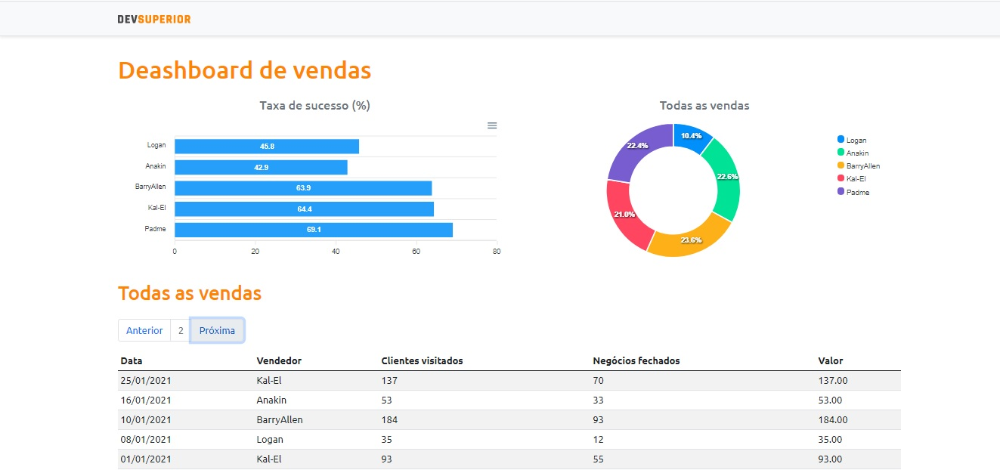

### Bem-vindo a DS vendas

### Um projeto desenvolvido durante a semana Spring React da DevSuperior

### ☄️ Descrição ☄️

<p>
   Analise o desempenho das suas vendas por diferentes perspectivas<br/>
   Esta aplicação consiste em exibir um dashboard a partir de dados<br/>
   fornecidos por um back end construído com Spring Boot.<br/>
</p>

<div>
   
</div>

### 🌌 Tecnologias 🌌

- Typescript
- ReactJs
- Spring boot

### 🌌 Database 🌌
- PostgreSQL

## 💾 Clone

```sh
https://github.com/setxpro/projeto-sds3.git
```

## 🗳 Install

```sh
yarn install
```

## 🚀 Usage

```sh
yarn start
```
## Author

👤 **Patrick Anjos**

* Website: https://patrick-dsvendas.netlify.app/
* Github: [@setxpro](https://github.com/setxpro)

Evento promovido pela escola DevSuperior:  [@devsuperios.ig](https://www.instagram.com/devsuperior.ig/) 🚀. <br>
